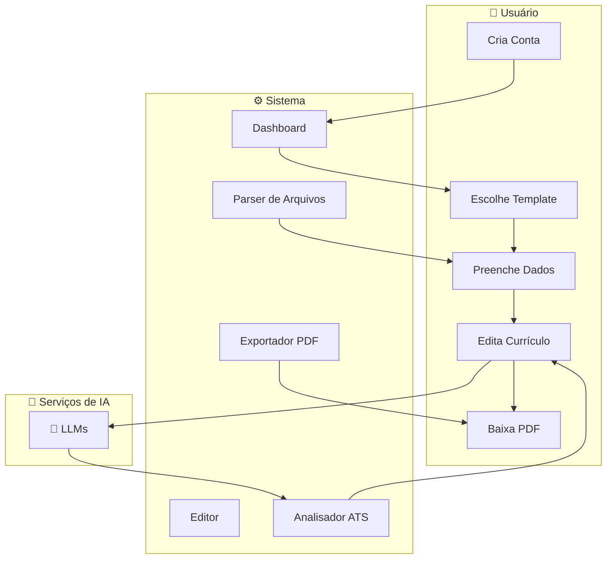
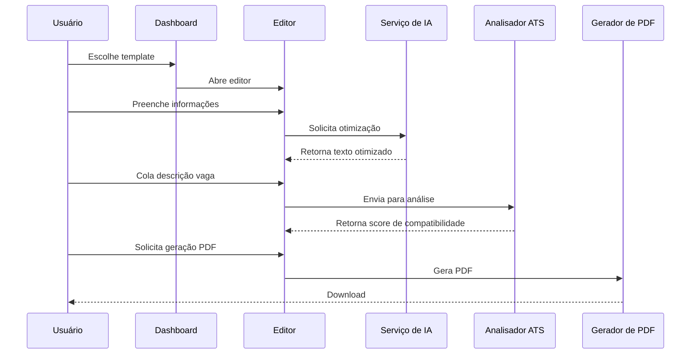

# ResuMatch - 

<div align="center">

[](https://github.com/otavio-lemos/ResuMatch)
[](https://opensource.org/licenses/MIT)
[](https://nextjs.org/)
[](https://www.typescriptlang.org/)
[](https://tailwindcss.com/)
[](https://opencode.ai)
[](https://kilocode.ai)
[](https://www.docker.com/)

*🇧🇷 [Português](./README.md) | 🇺🇸 [English](./README.en.md)*
  
⭐ Por favor, deixe uma estrela no projeto!
</div>

---

## 🔄 Fluxo da Aplicação





---

## 📋 Índice

- [ResuMatch - Construtor de Currículos com IA 🇧🇷 🇺🇸](#resumatch---construtor-de-currículos-com-ia--)
  - [🔄 Fluxo da Aplicação](#-fluxo-da-aplicação)
  - [📋 Índice](#-índice)
  - [🚀 Recursos](#-recursos)
    - [Funcionalidades Principais](#funcionalidades-principais)
    - [Templates](#templates)
    - [Recursos Adicionais](#recursos-adicionais)
  - [💻 Tecnologias](#-tecnologias)
  - [🏁 Como Começar](#-como-começar)
    - [Pré-requisitos](#pré-requisitos)
    - [Desenvolvimento Local](#desenvolvimento-local)
    - [Desenvolvimento com Docker](#desenvolvimento-com-docker)
      - [Checklist de Qualidade (executado automaticamente no build)](#checklist-de-qualidade-executado-automaticamente-no-build)
    - [Produção com Docker](#produção-com-docker)
  - [📁 Estrutura do Projeto](#-estrutura-do-projeto)
  - [⚙️ Configuração](#️-configuração)
    - [Provedores de IA](#provedores-de-ia)
    - [Variáveis de Ambiente](#variáveis-de-ambiente)
  - [🧪 Testes](#-testes)
  - [🔧 Ferramentas de Desenvolvimento](#-ferramentas-de-desenvolvimento)
    - [Scripts Disponíveis](#scripts-disponíveis)
    - [Scripts Docker](#scripts-docker)
  - [🤖 Agentes de IA \& Workflow de Desenvolvimento](#-agentes-de-ia--workflow-de-desenvolvimento)
    - [Agentes (`/.agent/agents/`)](#agentes-agentagents)
    - [Regras (`/rules/`)](#regras-rules)
    - [Scripts (`/scripts/`)](#scripts-scripts)
    - [Skills (`/skills/`)](#skills-skills)
    - [Workflows (`/workflows/`)](#workflows-workflows)
  - [📄 Licença](#-licença)

---

## 🚀 Recursos

### Funcionalidades Principais

| Recurso | Descrição |
|---------|------------|
| **🎯 Motor de Pontuação ATS** | Feedback em tempo real sobre legibilidade, densidade de conteúdo e palavras-chave |
| **🤖 Otimização com IA (Método STAR)** | Reescreva suas experiências usando a metodologia Situação, Tarefa, Ação, Resultado |
| **📄 Parsing Inteligente** | Importe PDFs, DOCX ou TXT e deixe a IA preencher todos os campos do currículo |
| **🔍 Compatibilidade com Vaga** | Cole uma descrição de vaga e receba análise de compatibilidade |
| **🌐 Suporte Multilíngue** | Tradução automática entre Português e Inglês |

### Templates

- **Standard Ivy League** - Clássico uma coluna, fonte serifada
- **Sleek Tech** - Moderno sans-serif, focado em tecnologia
- **Clean White Pro** - Minimalista, focado em espaços em branco
- **Global Executive** - Profissional com destaque no cabeçalho
- **Developer Core** - Técnico, habilidades em primeiro lugar
- **One-Page Power** - Compacto, máxima densidade
- **Harvard Strict ATS** - Acadêmico, otimizado para ATS
- **Corporate Standard** - Corporativo, tradicional

### Recursos Adicionais

- Suporte a modo escuro
- Persistência em armazenamento local
- Rate limiting para proteção de API
- Tratamento de erros com mensagens amigáveis
- Exportação em PDF para impressão

---

## 💻 Tecnologias

| Categoria | Tecnologia |
|-----------|------------|
| **Framework** | Next.js 15.1.7 (App Router) |
| **Linguagem** | TypeScript 5.9.3 |
| **Estilização** | Tailwind CSS 4.1.11 |
| **Gerenciamento de Estado** | Zustand 5.0.11 |
| **Animação** | Framer Motion |
| **Ícones** | Lucide React |
| **Formulários** | React Hook Form + Zod |
| **Testes** | Jest + React Testing Library + Playwright |
| **Processamento de PDF** | pdf-parse |
| **IA** | OpenAI, Google Gemini, Ollama |

---

## 🏁 Como Começar

### Pré-requisitos

- **Node.js** (v20 ou superior)
- **Docker** (recomendado para desenvolvimento)
- **npm** ou **yarn**

### Desenvolvimento Local

```bash
# Clone o repositório
git clone https://github.com/otavio-lemos/ResuMatch.git
cd resumatch

# Instale as dependências
npm install --legacy-peer-deps

# Inicie o servidor de desenvolvimento
npm run dev
```

Acesse a aplicação em: **http://localhost:3000**

### Desenvolvimento com Docker

Para desenvolvimento com ferramentas de auditoria:

```bash
# Build da imagem de desenvolvimento (inclui Python, make, g++ para pdf-parse)
docker build -f Dockerfile-DevOps -t resumatch-dev .

# Execute o container de desenvolvimento
docker run -p 3000:3000 resumatch-dev
```

**Após testar, remova a imagem de desenvolvimento:**
```bash
docker rmi resumatch-dev
```

#### Checklist de Qualidade (executado automaticamente no build)

O Dockerfile-DevOps executa automaticamente o checklist de qualidade antes de finalizar o build:

| Check | Descrição |
|-------|------------|
| **Security Scan** | Verifica vulnerabilidades e segredos expostos |
| **Lint Check** | Validação de código (ESLint, Ruff) |
| **Schema Validation** | Validação de estrutura de dados (JSON schemas) |
| **Test Runner** | Executa testes unitários (Jest) |
| **UX Audit** | Verifica boas práticas de UI/UX |
| **SEO Check** | Valida meta tags e estrutura SEO |

Se qualquer check falhar, o build é interrompido.

### Produção com Docker

```bash
# Build e execução do container de produção
docker-compose up -d --build

# Ver logs
docker-compose logs -f

# Pare os containers
docker-compose down
```

O build de produção usa o `Dockerfile` otimizado com build em múltiplas etapas.

---

## 📁 Estrutura do Projeto

```
├── app/                    # Next.js App Router
│   ├── api/               # Rotas de API
│   │   ├── analyze/       # Endpoint de análise de IA
│   │   └── parse-resume/  # Endpoint de parsing de currículo
│   ├── dashboard/         # Páginas do dashboard
│   ├── editor/           # Editor de currículo
│   ├── modelos/          # Seleção de templates
│   ├── import/          # Assistente de importação
│   ├── config/           # Página de configuração
│   └── layout.tsx        # Layout raiz
├── components/           # Componentes React reutilizáveis
├── lib/                  # Bibliotecas de utilidades
│   ├── templates/        # Definições de templates de currículo
│   ├── storage/         # Armazenamento de currículos
│   ├── ats-engine.ts   # Motor de pontuação ATS
│   └── translations.ts # Traduções i18n
├── store/               # Stores Zustand
├── hooks/               # Custom React hooks
├── .agent/              # Skills e workflows de AI Agent
└── public/              # Assets estáticos
```

---

## ⚙️ Configuração

### Provedores de IA

A aplicação suporta múltiplos provedores de IA. Configure-os na página de **Configurações**:

| Provedor | Descrição |
|----------|------------|
| **Google Gemini** | Provedor padrão (gemini-1.5-flash) |
| **OpenAI** | Modelos GPT (gpt-3.5-turbo, etc.) |
| **Ollama** | IA local (llama3.2:3b, etc.) |

Não são necessários arquivos `.env` - toda a configuração é feita através da interface.

### Variáveis de Ambiente

| Variável | Padrão | Descrição |
|----------|--------|------------|
| `NODE_ENV` | development | Modo de ambiente |
| `PORT` | 3000 | Porta do servidor |
| `NEXT_TELEMETRY_DISABLED` | 1 | Desabilitar telemetria do Next.js |

---

## 🧪 Testes

```bash
# Executar testes unitários
npm run test

# Executar testes em modo watch
npm run test:watch

# Executar testes E2E com Playwright (requer Docker)
npx playwright test
```

---

## ✅ Code Quality & Padrões

Este projeto segue padrões rigorosos de qualidade de código:

### Validação de Entrada
- **Zod** para validação de schemas em todas as API routes
- Validação de tipo e tamanho de arquivos (PDF, DOCX, TXT)
- Tratamento padronizado de erros com `lib/api-error.ts`

### Configuração Centralizada
- Valores mágicos extraídos para `lib/config.ts`
- Rate limiting, limits de upload, e UI config centralizados

### Error Handling
- `components/ErrorBoundary.tsx` para captura de erros React
- Error handlers padronizados nas API routes

### Testes Unitários
| Test Suite | Cobertura |
|------------|----------|
| `__tests__/api/analyze.test.ts` | Zod validation |
| `__tests__/api/parse-resume.test.ts` | File size/type validation |
| `__tests__/api/test-ai.test.ts` | Schema validation |
| `__tests__/lib/config.test.ts` | Config values |
| `__tests__/lib/api-error.test.ts` | Error handlers |

### Auditoria Automática (Docker DevOps)
O `Dockerfile-DevOps` executa automaticamente:
- Security Scan (vulnerabilidades)
- Lint Check (ESLint, Ruff)
- Schema Validation
- Test Runner (Jest)
- UX Audit
- SEO Check

---

## 🔧 Ferramentas de Desenvolvimento

### Scripts Disponíveis

| Comando | Descrição |
|---------|------------|
| `npm run dev` | Iniciar servidor de desenvolvimento |
| `npm run build` | Build para produção |
| `npm run start` | Iniciar servidor de produção |
| `npm run lint` | Executar ESLint |
| `npm run test` | Executar testes Jest |
| `npm run clean` | Limpar cache do Next.js |

### Scripts Docker

```bash
# Desenvolvimento com auditoria
docker build -f Dockerfile-DevOps -t resumatch-dev .

# Produção
docker-compose up -d --build
```

---

## 🤖 Agentes de IA & Workflow de Desenvolvimento

Este projeto inclui um conjunto de agentes de IA, skills e workflows para auxiliar no desenvolvimento:

### Agentes (`/.agent/agents/`)

| Agente | Descrição |
|--------|------------|
| **code-archaeologist.md** | Entenda rapidamente o código existente |
| **debugger.md** | Debugging sistemático e análise de causa raiz |
| **documentation-writer.md** | Criação de documentação técnica |
| **explorer-agent.md** | Explore o codebase para encontrar padrões |
| **frontend-specialist.md** | Melhores práticas de Next.js/Tailwind |
| **orchestrator.md** | Coordene múltiplas tarefas |
| **project-planner.md** | Planeje tarefas complexas |

### Regras (`/rules/`)

| Arquivo | Descrição |
|---------|------------|
| **GEMINI.md** | Regras e padrões de comportamento da IA |

### Scripts (`/scripts/`)

| Script | Descrição |
|--------|------------|
| **checklist.py** | Validações de pré-commit |
| **verify_all.py** | Verificação e validação geral |

### Skills (`/skills/`)

| Skill | Descrição |
|-------|------------|
| **api-patterns/** | Padrões e melhores práticas de API |
| **architecture/** | Guia de arquitetura de software |
| **ats-analyzer/** | Pontuação e análise ATS (PT/EN) |
| **brainstorming/** | Resolução criativa de problemas e ideação |
| **clean-code/** | Qualidade e manutenibilidade de código |
| **code-review-checklist/** | Guidelines de code review |
| **database-design/** | Design de schema de banco de dados |
| **deployment-procedures/** | Workflows de deploy |
| **frontend-design/** | UI/UX e acessibilidade |
| **game-development/** | Padrões de desenvolvimento de jogos |
| **i18n-localization/** | Internacionalização |
| **lint-and-validate/** | Linting e verificação de tipos |
| **mcp-builder/** | Desenvolvimento de servidor MCP |
| **mobile-design/** | Design mobile-first |
| **nextjs-react-expert/** | Melhores práticas de Next.js/React |
| **performance-profiling/** | Otimização de performance |
| **resume-editor/** | Edição e otimização de currículo (PT/EN) |
| **seo-fundamentals/** | Melhores práticas de SEO |
| **systematic-debugging/** | Metodologias de debugging |
| **tdd-workflow/** | Desenvolvimento orientado a testes |
| **testing-patterns/** | Estratégias de testes |
| **vulnerability-scanner/** | Verificação de segurança |
| **webapp-testing/** | Testes E2E com Playwright |

### Workflows (`/workflows/`)

| Workflow | Descrição |
|----------|------------|
| **brainstorm.md** | Ideação e validação de funcionalidades |
| **create.md** | Workflow de criação de código |
| **debug.md** | Processo de debugging sistemático |
| **enhance.md** | Workflow de melhoria de código |
| **orchestrate.md** | Coordenação de múltiplas tarefas |
| **plan.md** | Workflow de planejamento de tarefas |
| **test.md** | Workflow de testes |
| **ui-ux-pro-max.md** | Design UI/UX para templates de currículo |

Estes recursos podem ser usados com assistentes de coding com IA (como Claude, Cursor, etc.) para manter consistência e seguir os padrões do projeto.

---

## 📄 Licença

Este projeto está licenciado sob a Licença MIT.

---

<div align="center">
  Espero ajudar a conseguir seu próximo emprego.
</div>
