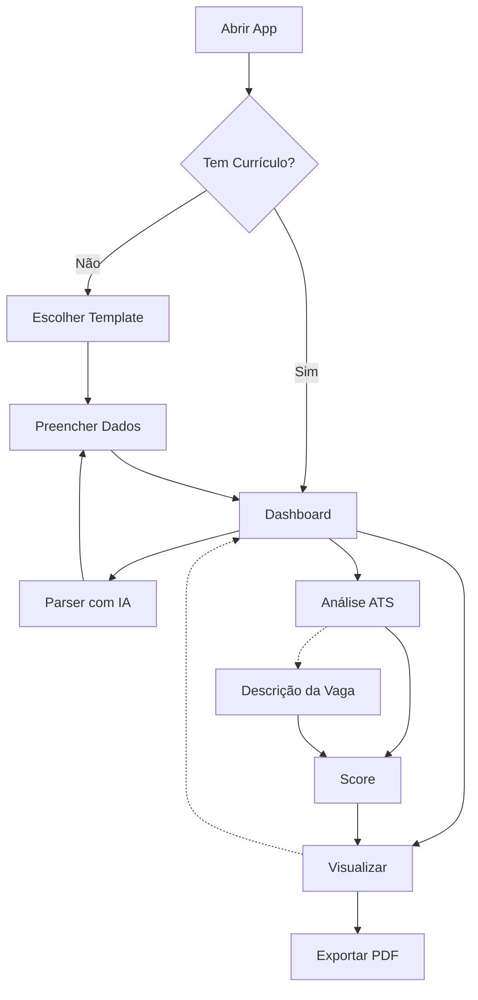

[Português 🇧🇷](./README.md) | [English 🇺🇸](./README.en.md)

# ResuMatch

> Construtor de Currículo com IA & Auditor ATS. Pare de adivinhar se seu currículo passa nos bots. O ResuMatch garante 100% de compatibilidade com sistemas ATS modernos.

[](https://opensource.org/licenses/MIT)
[](https://nextjs.org/)
[](https://www.typescriptlang.org)
[](https://www.docker.com/)

> [!IMPORTANT]
> **Privacidade Primeiro** - Este app é 100% privado. Nenhuma telemetria, analytics ou rastreamento é enviado para qualquer lugar. Os únicos dados transmitidos são quando você usa explicitamente um provedor de IA (Gemini, OpenAI ou Ollama) - e esses dados vão APENAS para o serviço de IA que você configurou.

## Início Rápido

### 🚀 Para os apressados

```bash
docker run -d -p 3000:3000 otaviera/images:resumatch-0.1.0
```

Acesse: [**http://localhost:3000**](http://localhost:3000)

### Opção 1: Docker Compose (desenvolvimento)

```bash
git clone https://github.com/otavio-lemos/ResuMatch.git
cd ResuMatch
docker-compose up -d --build

# Acompanhar logs:
docker-compose logs -f
```

> [!TIP]
> **Recomendação**: Use **Firefox** para imprimir e salvar como PDF para melhor compatibilidade com ATS.

> [!TIP]
> Para rodar com uma LLM local, instale [Ollama](https://ollama.com/) e baixe o modelo **qwen3:7b** (homologado para este app).

## Arquitetura



## Tech Stack

| Categoria | Tecnologia |
|-----------|------------|
| **Core** | Next.js 15 (App Router), TypeScript |
| **Design** | Tailwind CSS 4 |
| **Estado** | Zustand |
| **IA** | Google Gemini, OpenAI, Ollama |
| **Parsing** | Mammoth, PDF-Parse |
| **i18n** | next-intl |
| **Ícones** | Lucide React |
| **Animações** | Motion |
| **Export PDF** | React-to-Print |
| **Validação** | Zod |
| **Gráficos** | Recharts |

## Configuração

Acesse **Configurações** (`/config`) para configurar:
- Provedor de IA (Gemini, OpenAI, Ollama)
- Chaves de API (armazenadas no localStorage)
- Modelo preferido
