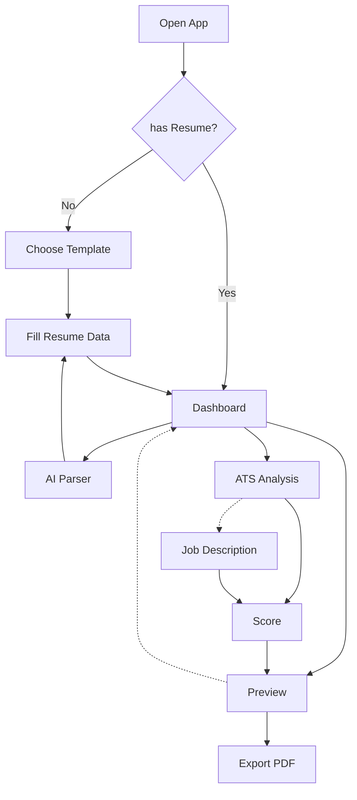

# ResuMatch

> Open-Source AI Resume Builder & ATS Auditor. Stop guessing if your resume passes the bot.

[](https://opensource.org/licenses/MIT)
[](https://nextjs.org/)
[](https://www.typescriptlang.org)
[](https://www.docker.com/)

> [!IMPORTANT]
> **Privacy First** - This app is 100% private. No telemetry, analytics, or tracking is sent anywhere. The only data transmitted is when you explicitly use an AI provider (Gemini, OpenAI, or Ollama) - and that data goes ONLY to the AI service you configure.

## Quick Start

```bash
git clone https://github.com/otavio-lemos/ResuMatch.git
cd ResuMatch
docker-compose up -d --build
```

Access: [**http://localhost:3000**](http://localhost:3000)

> [!TIP]
> **Recommendation**: Use **Firefox** for printing and saving as PDF for better ATS compatibility.

> [!TIP]
> To run with a local LLM, install [Ollama](https://ollama.com/) and download the **qwen3:7b** model (homologated for this app).

## Architecture



## Tech Stack

| Category | Technology |
|----------|------------|
| **Core** | Next.js 15 (App Router), TypeScript |
| **Design** | Tailwind CSS 4 |
| **State** | Zustand |
| **AI** | Google Gemini, OpenAI, Ollama |
| **Parsing** | Mammoth, PDF-Parse |
| **i18n** | next-intl |
| **Icons** | Lucide React |
| **Animations** | Motion |
| **PDF Export** | React-to-Print |
| **Validation** | Zod |
| **Charts** | Recharts |

## Configuration

Navigate to **Settings** (`/config`) to configure:
- AI Provider (Gemini, OpenAI, Ollama)
- API Keys (stored in localStorage)
- Preferred Model
