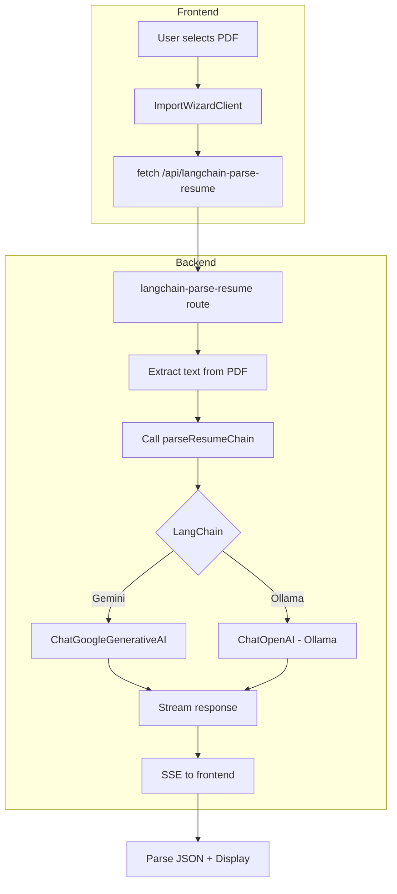
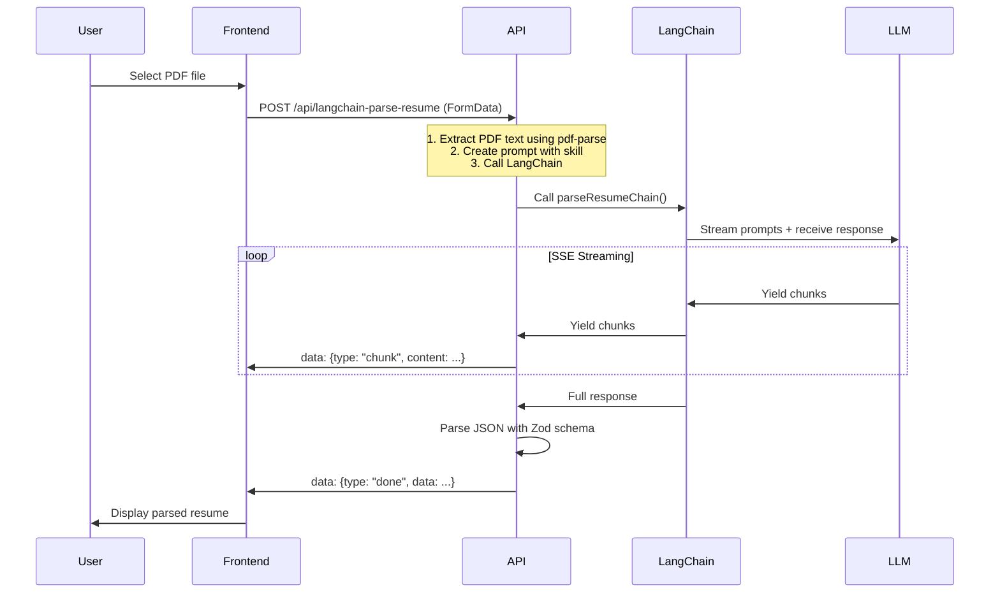

# ResuMatch - LangChain Integration

## Problema Original
O app estava com problemas no parsing de currículos via LLM. O objetivo era migrar para LangChain para:
- Melhor output JSON estruturado
- Streaming unificado
- Melhor tratamento de erros

## Solução Implementada

### Arquitetura



### Fluxo Completo



## Correções Feitas

### 1. Problema do Template
**Problema**: O PromptTemplate do LangChain interpreta `{}` como variáveis. Conteúdo com `}` quebrava o template.

**Solução**: Usar placeholders em vez de template variables:
```typescript
// Antes (quebrava com JSON no conteúdo)
const template = PromptTemplate.fromTemplate(`{resumeContent}`);

// Depois (funciona com qualquer conteúdo)
const template = `RESUME_CONTENT_PLACEHOLDER`.replace('PLACEHOLDER', content);
```

### 2. Providers Suportados
- **Gemini**: Suporta PDF diretamente, mas usamos extração de texto para consistência
- **Ollama**: NÃO suporta PDF - extração de texto é obrigatória

A rota extrai texto do PDF para ambos os casos (funciona para todos os providers).

## Arquivos Criados/Modificados

### Novos Arquivos (lib/ai/)
```
lib/ai/
├── client.ts          # Factory para ChatOpenAI/ChatGoogleGenerativeAI
├── parsers.ts         # Zod parsers para ResumeData, ATSAnalysis
├── types.ts           # Zod schemas
├── prompts/
│   ├── index.ts
│   └── parser.ts     # Prompt template
└── chains/
    ├── index.ts
    ├── parse-resume.ts
    ├── analyze-ats.ts
    └── rewrite-bullets.ts
```

### Rotas API
```
app/api/
├── langchain-parse-resume/route.ts  # Rota para parsing
└── langchain-analyze/route.ts      # Rota para análise ATS
```

###Frontend
- `app/import/ImportWizardClient.tsx` - Chamando `/api/langchain-parse-resume`

## Configuração

### Variáveis de Ambiente
No arquivo `.env`:
```
GEMINI_API_KEY=sua_chave_aqui
```

### Skills
As skills existentes em `.agent/skills/` são reutilizadas:
- `getAtsParserSkill()` - Para parsing de resume
- `getAtsAnalyzerSkill()` - Para análise ATS

## Testando

```bash
# Iniciar servidor
npm run dev

# Testar rota com arquivo
curl -X POST http://localhost:3000/api/langchain-parse-resume \
  -F "file=@seu_curriculo.pdf" \
  -F "language=pt"
```

## Status

| Item | Status |
|------|--------|
| Rota langchain-parse-resume | ✅ Funcionando |
| Extração de texto do PDF | ✅ Funcionando |
| Streaming SSE | ✅ Funcionando |
| Gemini provider | ✅ Configurado |
| Ollama provider | ✅ Configurado |
| API key necessária | ⚠️ Configure no .env |

## Erro Comum

Se ver o erro:
```
API key not valid. Please pass a valid API key
```

Significa que a API key no `.env` está inválida. Configure uma chave válida do Google AI Studio.
